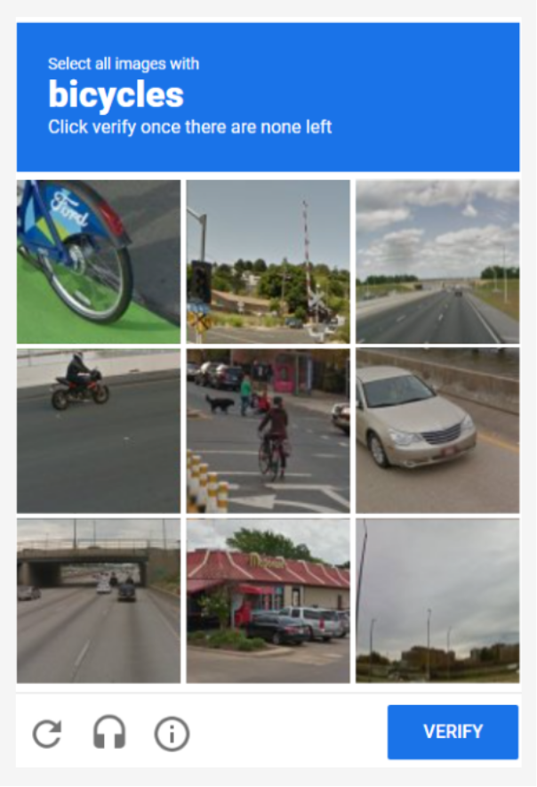
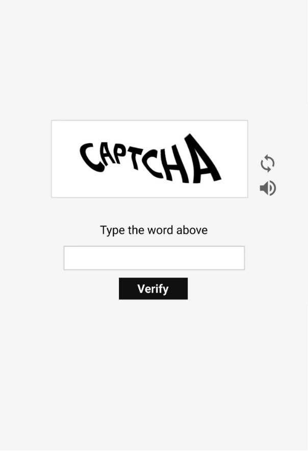
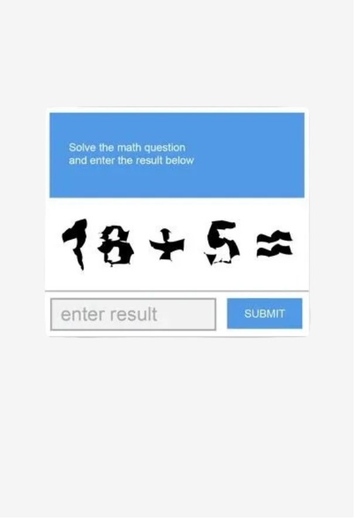
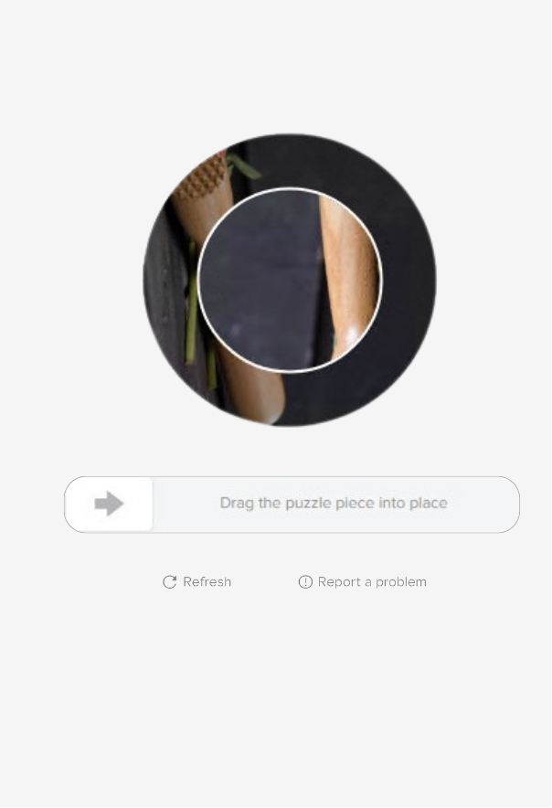
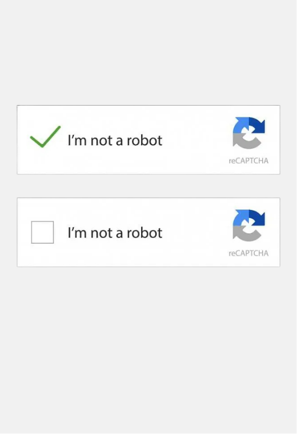

# CAPTCHA Triggering Rules and Protection Logic

CAPTCHA (Completely Automated Public Turing test to tell Computers and Humans Apart) is a security mechanism used to distinguish human users from automated programs (bots).

It helps protect services from spam, automated abuse, and other malicious activity by requiring users to complete a simple verification challenge before a request is processed.

Common CAPTCHA examples:

<tabs>
    <tab id="image-captcha" title="Image-based">
       
Image-based CAPTCHA asks users to identify or select specific objects within a set of images.

       
    </tab>
    <tab id="text-captcha" title="Text-based">
        
Text-based CAPTCHA challenges users with distorted or scrambled characters.

       
    </tab>
    <tab id="math-captcha" title="Math">
       
Math CAPTCHA asks users to solve simple arithmetic problems.

       
    </tab>
     <tab id="slider-captcha" title="Slider">
       
Slider CAPTCHA requires the user to drag a puzzle piece into the correct spot on an image.

       
    </tab>
     <tab id="checkbox-captcha" title="Checkbox">
       
Checkbox CAPTCHA asks users to confirm they are not a robot by checking a box while the system analyzes their interaction behavior.

       
    </tab>
</tabs>

<note type="info">
    Our service uses (specific CAPTCHA) which presents (specific CAPTCHA style).
</note>

### Why CAPTCHA is not shown on every request?

CAPTCHA is a common mechanism used to protect services from
automated abuse and malicious traffic.

However, displaying CAPTCHA on every interaction negatively impacts
user experience. It interrupts user flow and may reduce user retention,
especially for legitimate users.

To balance security and usability, Forms Service applies CAPTCHA
selectively based on predefined risk detection rules.

### When CAPTCHA is triggered?

The service triggers CAPTCHA verification when one of the following conditions is met:

<table>
    <tr>
        <th>Trigger condition</th>
        <th>Potential risk</th>
        <th>Example scenario</th>
        <th>Possible legitimate causes</th>
    </tr>
    <tr>
        <td>>500 requests from the same IP within 20 minutes</td>
        <td>A single source sending requests at an unusually high rate</td>
         <td>A user repeatedly clicking Submit because the page appears unresponsive</td>
        <td>Shared office network, VPN, load testing</td>
    </tr>
    <tr>
        <td>IP address is in <tooltip term="blacklist">blacklist</tooltip></td>
        <td>Traffic from a source previously identified as abusive</td>
         <td>A request from an IP previously used in spam attacks</td>
        <td>Reassigned IP address, shared proxy networks</td>
    </tr> 
 <tr>
        <td>Current <tooltip term="hour-bucket">hour bucket</tooltip> exceeds 2x average traffic (last 2 weeks)</td>
        <td>Traffic spike that may indicate automated activity or a coordinated attack</td>
         <td>A sudden burst of form submissions following a marketing email</td>
        <td>Marketing campaign, product launch, incident causing retries</td>
    </tr>
 <tr>
        <td>Same <tooltip term="payload">payload</tooltip> sent >5 times in 30 seconds</td>
        <td>Repetitive submission of identical data, often from a misconfigured or malicious script</td>
         <td>A user double-clicking the Submit button</td>
        <td>Unstable internet connection, retry logic in custom clients</td>
    </tr>
 <tr>
        <td>CAPTCHA enabled manually via the admin panel</td>
        <td>Temporary enforcement of stricter verification during a security incident</td>
        <td>An administrator enables CAPTCHA during a suspected spam attack</td>
        <td>Incident mitigation or temporary restriction</td>
    </tr>
</table>  

### What happens after CAPTCHA is triggered?

The request is temporarily paused, and a CAPTCHA challenge is presented to the user. The request is processed only after
the challenge is successfully completed.

The following diagram illustrates how the system decides when to trigger CAPTCHA verification:

<code-block lang="mermaid">
graph LR
   A[User submits form] --> B[Trigger detected]
   B -- No --> C[Request processed]
   B -- Yes --> D[Show CAPTCHA]
   D --> E[User solves challenge]
   E --> F[Valid?]
   F -- Yes --> C 
   F -- No --> G[Request blocked]
</code-block>

## FAQ

<deflist collapsible="true">
    <def title="Does CAPTCHA permanently block the request?" default-state="collapsed">
        No. CAPTCHA is a verification step. If the user successfully completes the challenge, the request continues and is processed normally.
    </def>
    <def title="What happens if the CAPTCHA challenge fails?" default-state="collapsed">
        If the challenge is not completed successfully, the request is rejected. The user must retry the request and complete the CAPTCHA verification.
    </def>
    <def title="Can legitimate users trigger CAPTCHA?" default-state="collapsed">
        Yes. Shared networks, VPN usage, or repeated submissions can activate protection rules.
    </def>
    <def title="How can I check if an IP address is blacklisted?" default-state="collapsed">
    Blacklisted IP addresses are typically visible in the service's security monitoring tools or administration panel. For more information, see the Security Events Dashboard Guide.
</def>
</deflist>

## See also

* **CAPTCHA Configuration Reference** - Describes how administrators configure CAPTCHA behavior and thresholds.
* **Security Events Dashboard Guide** - Explains how to monitor suspicious traffic and CAPTCHA triggers.
* **Incident Response Playbook** - Steps for responding to suspected abuse or traffic spikes.

* [Google reCAPTCHA Documentation](https://developers.google.com/recaptcha) - Overview of the reCAPTCHA security mechanism and implementation.

> **Note:** Internal documentation links are placeholders and will be created in the future.

